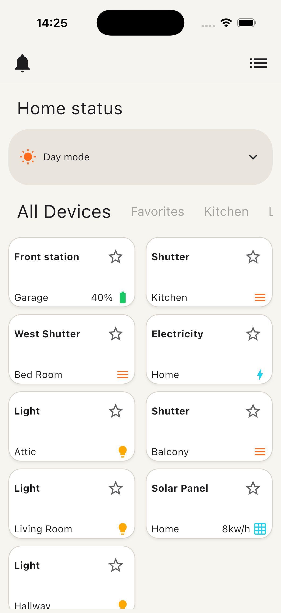
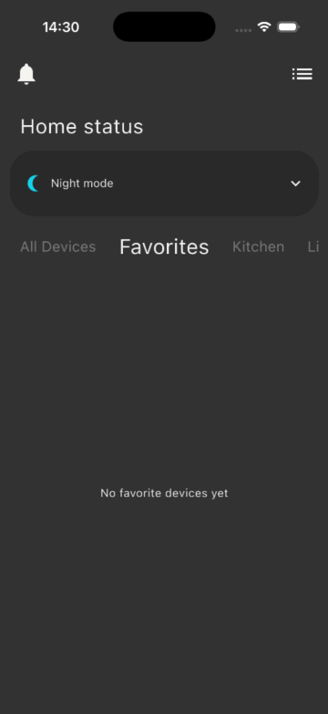

# Smart Control Home UI

Flutter ve Dart öğrenirken edindiğim bilgileri pekiştirmek amacıyla geliştirdiğim akıllı ev kontrol paneli arayüzü.

> [!NOTE]
> Bu proje eğitim ve pratik amacıyla hazırlanmıştır. Projenin fikri ve arayüzü örnek bir çalışmadan kopyalanarak/uyarlanarak Flutter ile yeniden oluşturulmuştur. Çalışma yalnızca kullanıcı arayüzünü kapsar; gerçek cihaz, API, veritabanı, Firebase veya IoT entegrasyonu içermez.

## Proje Hakkında

Smart Control Home UI; evdeki cihazları oda bazında görüntüleyen, favori cihazları ayıran ve gündüz/gece görünümü arasında geçiş yapılmasını sağlayan bir Flutter arayüz çalışmasıdır.

Bu projeyi, kişisel öğrenme repom olan [Flutter & Dart Learning Journey](https://github.com/Sametkrlii/Flutter-Dart-Learning-Journey/tree/main) ile birlikte ilerlerken öğrendiğim konuları küçük ve uygulanabilir bir projede tekrar etmek için hazırladım.

## Uygulama Görünümü

<table>
  <tr>
    <td align="center"><strong>Ekran Görüntüsü</strong></td>
    <td align="center"><strong>Uygulama Demosu</strong></td>
  </tr>
  <tr>
    <td align="center">
      
    </td>
    <td align="center">
      
    </td>
  </tr>
</table>

## Özellikler

- Gündüz ve gece görünümü arasında geçiş
- Tüm cihazları tek ekranda listeleme
- Cihazları odalara göre filtreleme
- Cihazları favorilere ekleme ve favorilerden çıkarma
- Yatay kaydırılabilir kategori sekmeleri
- İki sütunlu cihaz kartı görünümü
- Boş kategori ve favori durumları için bilgilendirme mesajları
- Yeniden kullanılabilir widget yapısı

## Kullandığım Flutter ve Dart Yapıları

- `StatefulWidget` ve `StatelessWidget`
- `setState` ile temel durum yönetimi
- `List.where()` ve `toList()` ile liste filtreleme
- `ListView.separated` ile yatay kategori listesi
- `GridView.builder` ile dinamik cihaz kartları
- `DropdownButton` ile mod seçimi
- `ValueChanged` ve `VoidCallback` ile widget'lar arası iletişim
- Model sınıfı ile cihaz verilerini temsil etme
- Tema renklerini ve boşluk değerlerini ortak sabitlerde tutma
- Koşullu widget gösterimi

## Proje Yapısı

```text
assets/
├── gifs/
│   └── app_demo.gif
└── screenshots/
    └── app_preview.png

lib/
├── constants/
│   ├── app_colors.dart
│   └── app_paddings.dart
├── models/
│   └── device_data.dart
├── screens/
│   └── home/
│       └── home_view.dart
├── widgets/
│   ├── category_tabs.dart
│   ├── device_card.dart
│   └── mode_dropdown.dart
└── main.dart
```

## Dosyaların Sorumlulukları

- `app_colors.dart`: Uygulamanın gündüz, gece, metin, kart ve vurgu renklerini içerir.
- `app_paddings.dart`: Arayüz genelinde kullanılan ortak padding değerlerini tutar.
- `device_data.dart`: Cihaz adı, oda, ikon, ölçü birimi ve favori durumu gibi verileri temsil eder.
- `home_view.dart`: Cihaz listesini, tema değişimini, kategori seçimini ve favori durumunu yönetir.
- `category_tabs.dart`: Kategori ve oda seçeneklerini yatay bir liste halinde gösterir.
- `device_card.dart`: Her cihazın bilgilerini kart görünümünde sunar.
- `mode_dropdown.dart`: Gündüz ve gece modu seçimini sağlar.
- `main.dart`: Uygulamayı başlatır ve genel Material tema ayarlarını tanımlar.

## Çalıştırma

Bilgisayarınızda Flutter SDK kurulu olmalıdır.

```bash
flutter pub get
flutter run
```

## Mevcut Sınırlamalar

- Cihaz verileri uygulama içinde statik olarak tanımlanmıştır.
- Değişiklikler uygulama kapatıldığında saklanmaz.
- Bildirim ve menü butonlarının henüz bir işlevi yoktur.
- Gerçek akıllı ev cihazlarını kontrol etmez.
- Herhangi bir kullanıcı girişi, ağ bağlantısı veya arka uç servisi bulunmaz.

## Öğrenme Süreci

Flutter ve Dart çalışmalarımı, örneklerimi ve öğrenme sürecimi aşağıdaki repoda düzenli olarak paylaşıyorum:

**[Flutter & Dart Learning Journey](https://github.com/Sametkrlii/Flutter-Dart-Learning-Journey/tree/main)**

Bu proje ticari bir ürün değil, öğrendiklerimi pekiştirmek ve gelişimimi takip etmek için hazırladığım bir UI çalışmasıdır.
